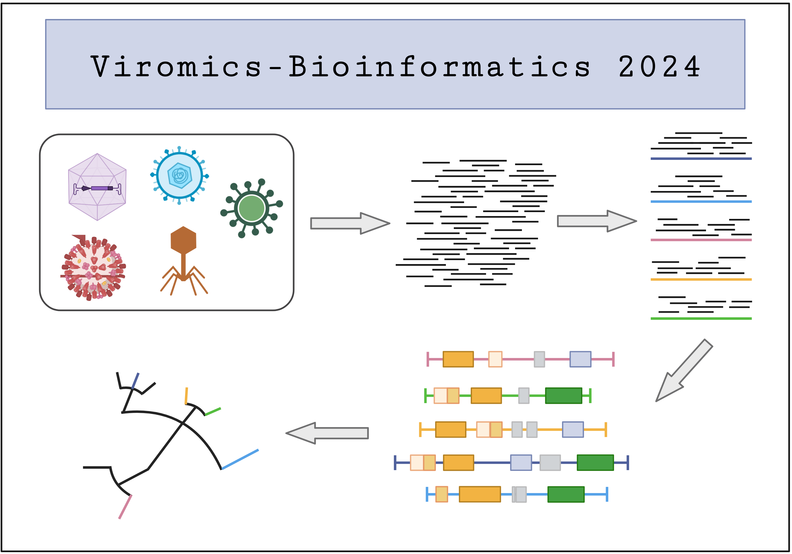

# Advanced Module "Viromics-Bioinformatics": 2024

This repository contains information about the advanced module "Viromics Bioinformatics" of the Masters program in Microbiology of the Friedrich-Schiller University of Jena. 

  

# Admission requirements

To be admitted to this module, you should have at least a basic-level knowledge of bash/linux command line. Alternatively, you can follow the self study material indicated in the link below before the start of the module.  

https://github.com/waltercostamb/course_viral-microbiology_2023/blob/main/study_material.md
